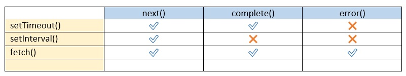

## Xây dựng RxJs và Observable (Trần Công Lực) 
### Tác giả: Trần Công Lực
### Facebook: https://www.facebook.com/congluc1902/
### Youtube: https://www.youtube.com/channel/UCZo9GHfowJ_bqdyUzZCaSig

<hr />

### Bài 01 - Giới thiệu Series, Promise vs Observable 
Giới thiệu tài liệu
Để tìm hiểu và sử dụng FrontEnd Framework JS Angular thì 
BẮT BUỘC:
- TypeScript
- **RxJs, Observable Pattern (Cực kì phức tạp)**

Mục tiêu của Docs này:
- Hiểu được cơ chế hoạt động của **Observable** và **RxJs**
- Tự xây dựng một bản **RxJs Mini** từ đầu ứng dụng **Observable**
- Cú pháp xây dựng bắt đầu từ **RxJs v5.0**

**Promise là gì?**
- Oh – ECMAScript dùng **placeholder** để mô tả Promise khá là dễ hiểu
- Như placeholder của input trong HTML nó đại diện cho 1 giá trị ở 1 nơi mà sẽ được người dùng thay thay thế.
- Thì Promise là 1 obj mô tả cho việc chúng ta tạm thời để chừa ra 1 nơi trống để sau này chứa phần data đc trả về từ 1 tác vụ bị trì hoãn (bất đồng bộ chưa trả về data ngay mà phải đợi ...)
- **Note:** Promise được thiết kế chỉ xử lí 1 tác vụ bất đồng bộ và nó sẽ trả về **1 cái giá trị (bản chất Promise thiết kế ra là vậy)**. Và nếu chúng ta muốn áp dụng vào những **mô hình trả về nhiều giá trị** thì chúng ta **KHÔNG DÙNG PROMISE** được. **=> Khái niệm Observable**

#### Example: setTimeout()
```js
function timeout(ms) {
  return new Promise((successFn, errorFn) => {
    setTimeout(() => {
      successFn('Return Data....')
      successFn('Return Data....')
      successFn('Return Data....')
    }, ms)
  })
}

timeout(2000)
  .then((data) => {
    console.log('Data: ', data)
  })
// Promise vẫn sẽ xử lí và resolve() 1 lần duy nhất

```
#### Example: setInterval()

```js
function interval(ms) {
  return new Promise((successFn, errorFn) => {
    setInterval(() => {
      successFn('Return Data....')
      successFn('Return Data....')
      successFn('Return Data....')
    }, ms)
  })
}

interval(2000)
  .then((data) => {
    console.log('Data: ', data)
  })
// Promise vẫn sẽ xử lí và resolve() 1 lần duy nhất

```
**=> Khái niệm Observable:** Nó có thể xử lí những tác vụ bất đồng bộ mà nó trả về nhiều giá trị ngắt quãng trong tương lai (Khắc phục Promise khi có những nhu cầu) – ngoài vấn đề trên thì nó còn có thể xử lí thêm nhiều thứ khác.

<hr />

### Bài 02 - Tìm hiểu Observable, Producer và Consumer

<hr />

### Bài 03 - Observable, subscribe, next với timeout và interval 

<hr />

### Bài 04 - Lazy Observable với timeout

<hr />

### Bài 05 - Observable cơ bản với interval

<hr />

### Bài 06 - Subscription và unsubscribe trong Observable?

<hr />

### Bài 07 - Tìm hiểu về Observer

<hr />

### Bài 08 và 09 - Hiện thực Observer or Next

<hr />

```diff
@@ Pink @@

```


